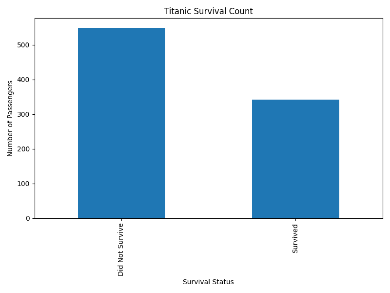
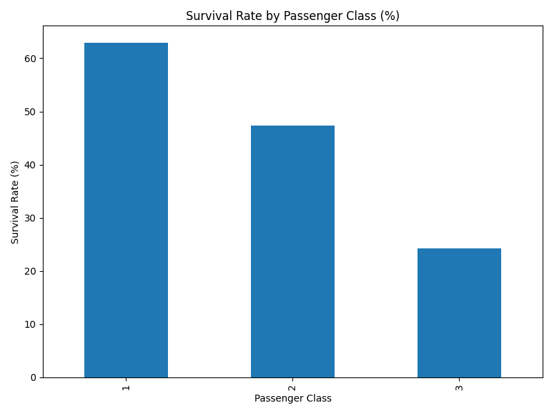
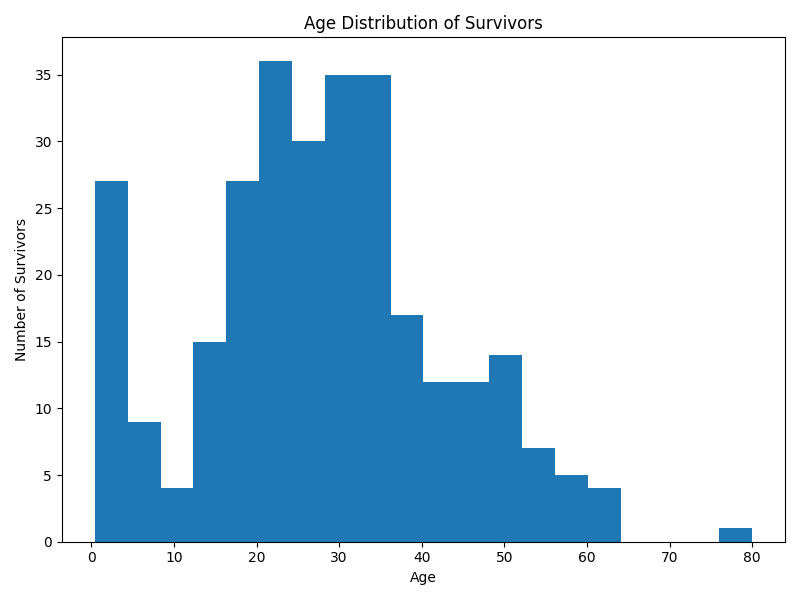
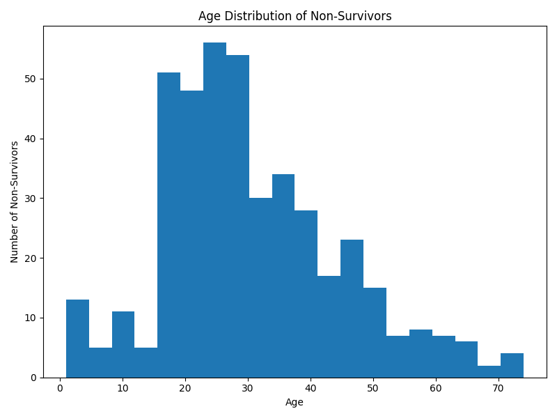
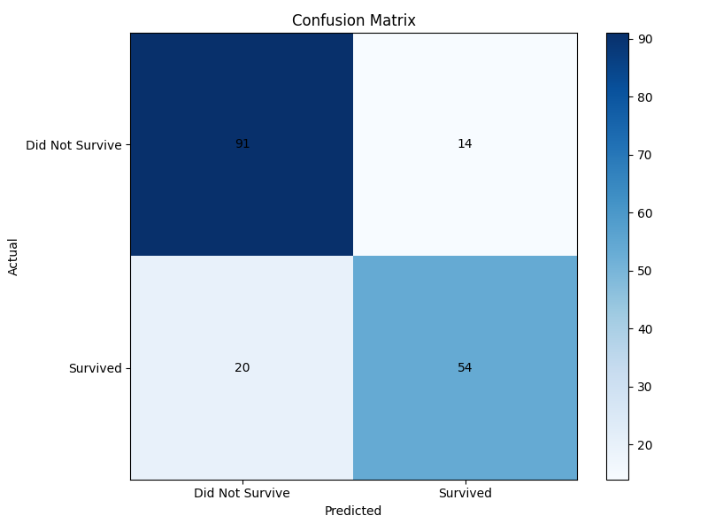

# Titanic Survival Analysis & Prediction

This project analyses the Titanic dataset and predicts passenger survival using Python and machine learning.  

It includes **data visualization**, **exploratory data analysis (EDA)**, and a **Logistic Regression model** for survival prediction.

---

## Features

- **Exploratory Data Analysis (EDA)**
  - Titanic survival count
  - Survival rate by gender
  - Survival rate by passenger class
  - Age distribution of survivors and non-survivors

- **Machine Learning**
  - Logistic Regression model trained on `train.csv`
  - Predictions for unseen passengers in `test.csv`
  - Confusion matrix to evaluate model performance

- **Outputs**
  - `survivors.csv` – list of passengers who survived
  - `non_survivors.csv` – list of passengers who did not survive
  - `ml_submission.csv` – predictions for test data
  - Saved charts in `charts/` folder

---

## Charts








---

## Installation & Dependencies

Install Python packages using pip:

```bash
pip install pandas matplotlib scikit-learn
```

## How to Run

1) Place train.csv and test.csv in the project folder.
2) Run the Python script:
```bash
python titanic.py
```
3) Charts will be saved in the charts/ folder.
4) Machine learning predictions will be saved in ml_submission.csv.
